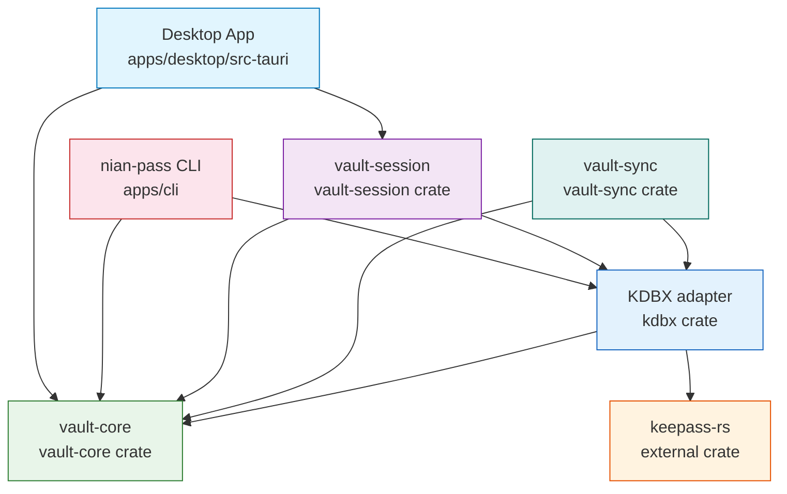

# Architecture Overview

Nian Pass is a KDBX-native, offline-first password manager. The `.kdbx` file is the source of truth. The workspace provides read/write KDBX operations, verified local persistence, a provider-independent three-way semantic merge engine, and a Tauri 2 desktop application.

## Dependency Direction



- **`vault-core`** owns KDBX-independent domain types including secret handling. It has no dependency on any KDBX library.
- **`kdbx`** is the adapter that contains all `keepass-rs` types, converts them to the domain model, and provides mutations, save, and three-way merge. `keepass` types are intentionally confined to this crate's private implementation.
- **`vault-session`** owns filesystem paths and the verified atomic persistence protocol. It depends on `kdbx` and `vault-core` but never exposes `keepass-rs` types.
- **`vault-sync`** is a thin orchestration layer over the three-way merge engine. It has no filesystem, network, or async responsibility.
- **`apps/cli`** consumes only the adapter's public API and `vault-core` values. It never imports `keepass` directly.
- **`apps/desktop`** depends on `vault-session` and `vault-core` — never on the KDBX adapter directly. The Tauri backend exposes a secret-free IPC surface; the React frontend receives only presentation DTOs.

## Domain Model

The domain model is a **secret-free presentation projection** of an opened vault, plus narrow request and metadata types for structural operations. Group names, custom-field names, visible entry metadata, and identifiers remain privacy-sensitive.

### Core Types (`vault-core`)

| Type | Purpose |
|---|---|
| `Vault` | Read-only view of an opened vault. Wraps the root `Group`. |
| `Group` | A named vault group with child groups and entries. Supports recursive `find_group` by `GroupId`. |
| `EntrySummary` | Secret-free entry projection: id, title, username, URL (as `SummaryText`), tags, `has_password`, `has_notes`. |
| `SummaryText` | `Missing \| Visible(String) \| Protected` — avoids leaking protected plaintext in projections. |
| `SecretString` | Zeroizing owned plaintext wrapper. No `Debug`, `Clone`, `Display`, or serialization. |
| `CustomFieldSummary` | Privacy-sensitive field name + `FieldProtection`, no value. |
| `FieldProtection` | `Protected \| Unprotected` — encryption state of a custom field. |
| `NewEntry` | Creation request DTO: title, username, URL, optional `SecretString` password. |
| `GroupId` | Stable group identifier copied across the adapter boundary. |
| `EntryId` | Stable entry identifier copied across the adapter boundary. |

**Key design decisions:**

- `Vault`, `Group`, `EntrySummary`, `SummaryText`, `SecretString`, and `CustomFieldSummary` do **not** implement `Debug`, preventing accidental dumps.
- `SecretString` uses `zeroize::Zeroizing<String>` internally; plaintext access is explicit via `expose_secret()`.
- `GroupId` and `EntryId` are opaque string wrappers — their format depends on the KDBX adapter.
- `group_count()` and `entry_count()` are O(n) recursive traversals. The domain model has no caching.

### KDBX Adapter (`kdbx`)

The adapter provides open, mutate, save, and three-way merge over a complete in-memory KDBX representation. `keepass-rs` types are entirely private.

**Open:**

```rust
pub fn open(path, master_password) -> Result<OpenedVault, KdbxError>
pub fn open_reader(reader, master_password) -> Result<OpenedVault, KdbxError>
```

**Entry mutations** (all use stable `EntryId`, preserve protection mode, track history):

| Method | Purpose |
|---|---|
| `set_entry_title` | Rename, preserving existing protection mode |
| `set_entry_username` | Change username, preserving protection mode |
| `set_entry_url` | Change URL without normalization |
| `set_entry_password` | Change password, preserving protection mode |
| `create_entry` | Create in a group, returns `EntryId` |
| `permanently_delete_entry` | Remove + tombstone (not recycle-bin) |
| `move_entry` | Relocate without field history |

**Group mutations:**

| Method | Purpose |
|---|---|
| `create_group` | Create beneath a parent, returns `GroupId` |
| `rename_group` | Rename without inventing entry history |
| `move_group` | Relocate with root/cycle validation |
| `permanently_delete_group` | Recursive subtree removal + tombstones |

**Custom fields:**

| Method | Purpose |
|---|---|
| `custom_fields(id)` | List names + protection metadata (no values) |
| `entry_custom_field(entry, name)` | Fetch one value as `SecretString` |
| `set_entry_custom_field` | Create or update, preserving existing protection |
| `delete_entry_custom_field` | Remove (no-op if missing) |

**Save and verification:**

| Method | Purpose |
|---|---|
| `save_to_writer(writer, password)` | Serialize to KDBX 4.1 only |
| `verify_semantic_equivalence(other)` | Structural equality ignoring salts/IVs |
| `semantically_equals(other)` | Boolean variant of above |

**Error variants** (`KdbxError`, `#[non_exhaustive]`):

| Variant | Meaning |
|---|---|
| `Io` | Database file could not be read |
| `InvalidKdbx` | Truncated, malformed, or not a KDBX file |
| `InvalidCredentials` | Master password rejected |
| `UnsupportedFormat` | KDBX format or feature not supported |
| `Conversion` | Valid database could not be represented by the domain model |
| `UnsupportedWriteFormat` | Only KDBX 4.1 is writable |
| `EntryNotFound` | No entry matched the stable identifier |
| `GroupNotFound` | No group matched the stable identifier |
| `CannotDeleteRootGroup` | Root group cannot be permanently deleted |
| `InvalidGroupMove` | Target would create cycle or move root |
| `ReservedField` | Generic custom-field API targeted a reserved name |
| `WriteIo` | Output writer rejected a write |
| `Serialization` | Complete document could not be serialized |
| `VerificationFailed` | Round-trip semantics differ |
| `SyncInvariant` | Sync candidate violated a required invariant |

## Desktop Application (Tauri 2 + React)

`apps/desktop` is the first visible Nian Pass application: a Tauri 2 shell with React, strict TypeScript, and Vite. The Tauri backend is in `apps/desktop/src-tauri/` and depends on `vault-session` and `vault-core`. The React frontend is in `apps/desktop/src/`.

**Backend (Rust):**
- 4 Tauri IPC commands: `select_vault`, `unlock_vault`, `vault_snapshot`, `lock_vault`
- `AppState` holds at most one unlocked `VaultSession` behind `Arc<Mutex<...>>`
- All errors serialize as `DesktopErrorDto` with stable error codes — no paths, parser details, or secrets leak to IPC
- Only `tauri-plugin-dialog` is allowed; shell, HTTP, clipboard, fs, updater, and process plugins are forbidden

**Frontend (React/TypeScript):**
- `lib/desktop.ts` is the sole IPC gateway — all `invoke()` calls are centralized
- `lib/validation.ts` validates all DTOs from the Rust backend at runtime
- `features/vault/` renders `GroupTree` + `EntryList` with pure client-side navigation
- Strict TypeScript: `strict`, `noUncheckedIndexedAccess`, `exactOptionalPropertyTypes`

**Secret boundary:**
- `SecretString`, `KdbxDocument`, and `VaultSession` cannot derive `Serialize`
- IPC DTOs carry `passwordPresent: bool` and `SummaryTextDto` (protected/missing/visible) — never actual secrets
- No browser persistence (localStorage, sessionStorage, IndexedDB, cookies are forbidden)

**Contract testing:** A committed `contracts/desktop-contract.json` fixture is validated bidirectionally — from a Rust `#[test]` and from TypeScript Vitest — to ensure IPC serialization never silently breaks.

## Three-Way Sync Engine

The sync engine lives in `kdbx/src/sync.rs` (~1700 lines) and is orchestrated by `vault-sync`. It performs provider-independent, synchronous three-way semantic merge on already-opened `KdbxDocument` triples.

See [architecture/sync-engine](/openwiki/architecture/sync-engine.md) for the full merge model, conflict types, and validation invariants.

**Public surface through `vault-sync`:**

```rust
pub fn merge(base, local, remote) -> Result<MergeOutcome, MergeError>
```

**`MergeOutcome` variants:**

| Variant | Meaning |
|---|---|
| `Equivalent` | Local and remote have identical semantics |
| `FastForwardLocal` | Remote still equals base; local is the successor |
| `FastForwardRemote` | Local still equals base; remote is the successor |
| `Merged(MergedDocument)` | Both diverged; all changes synthesized cleanly |
| `Conflicted(MergeConflictSet)` | Ambiguous changes detected; no merged document |

The engine clones LOCAL as a candidate, applies REMOTE's deltas using three-way choice (LOCAL==BASE → take REMOTE, REMOTE==BASE → keep LOCAL, both changed → conflict). It handles entries, groups, custom icons, metadata, tombstones, history (attachment-safe merging), and child-order preservation.

## Verified Persistence

`vault-session` owns filesystem paths and the multi-stage verified save protocol.

See [architecture/persistence](/openwiki/architecture/persistence.md) for the full save protocol, fingerprint verification, and platform limitations.

**Key types:**

| Type | Purpose |
|---|---|
| `VaultSession` | Holds path, `KdbxDocument`, `FileFingerprint`, `saved_revision` |
| `FileFingerprint` | SHA-256 + size of encrypted bytes (no `Debug`) |
| `SaveOutcome` | `Unchanged \| Saved` |

**Public API:**

| Method | Purpose |
|---|---|
| `VaultSession::open(path, credential)` | Canonicalize, reject symlinks, fingerprint |
| `projection()` | Fresh `Vault` snapshot |
| `is_dirty()` | Whether in-memory mutations exist since save |
| `save(credential)` | 16-step verified atomic persistence |
| `lock()` | Consume session, drop decrypted state |

## Architecture Invariants

These invariants are documented in `docs/architecture.md` and enforced by code structure:

1. **KDBX is the source of truth.** The domain model is a projection, not a serialization format.
2. **KeePass/KeePassXC interoperability must never break.** Loss of supported semantic data is a P0 bug.
3. **No sync server may possess vault decryption keys.**
4. **Vault decryption and conflict merge happen client-side.**
5. **UI/platform layers must not depend directly on the KDBX implementation.**
6. **KDBX-specific types must not leak outside the adapter boundary.**
7. **Sensitive values must never be intentionally written to logs.**
8. **Saving a vault must not silently discard unsupported/unknown semantic data.**
9. **Sync conflict descriptors never carry competing plaintext values.**
10. **Persistence verifies semantic equivalence at every filesystem boundary.**
11. **`#[tauri::command]` is allowed only in `apps/desktop/src-tauri/src/commands.rs`.**
12. **`keepass::` types are confined to `crates/kdbx/`.**
13. **Core crates must not depend on Tauri.**
14. **`SecretString`, `KdbxDocument`, and `VaultSession` must not derive `Serialize`.**
15. **The IPC surface carries no secrets — only `passwordPresent` booleans and protection-mode enums.**

## Security Design

- The CLI reads the master password via `rpassword::prompt_password` (no echo, no CLI argument).
- `SecretString` uses `zeroize::Zeroizing<String>`, clearing memory on drop; no `Debug`/`Clone`/`Display`.
- Adapter errors never embed the password or entry/group identifiers.
- The projection excludes all secret fields by design — `SecretString` values require explicit `expose_secret()`.
- `vault-session` never retains the master password; credentials are supplied per-operation.
- `vault-sync` conflict descriptors identify objects and field categories but never carry competing values.
- **Desktop IPC** exposes only `passwordPresent: bool` and `SummaryTextDto` (protected/missing/visible) — never actual secret values. The absolute file path stays in Rust; JavaScript receives only the selected filename.
- **Tauri capabilities** are locked to `core:default` permissions only. CSP prohibits `unsafe-eval`, wildcard sources, and arbitrary remote HTTPS origins.
- **Browser persistence** (localStorage, sessionStorage, IndexedDB, cookies) is forbidden for vault UI state.

See the [threat model](/docs/threat-model.md) for assets, assumptions, and gaps. See [write safety](/docs/write-safety.md) for persistence guarantees and platform limitations. See [quality policy](/docs/quality.md) for machine-enforced architecture and security guards.

## Source Map

| Path | Role |
|---|---|
| `apps/cli/src/main.rs` | CLI entry point: argument parsing, password prompt, output formatting |
| `apps/desktop/src-tauri/src/commands.rs` | Tauri IPC commands: select, unlock, snapshot, lock |
| `apps/desktop/src-tauri/src/state.rs` | `DesktopVaultService` managing one `VaultSession` behind `Arc<Mutex>` |
| `apps/desktop/src-tauri/src/dto.rs` | IPC DTOs: `VaultSnapshotDto`, `EntrySummaryDto`, `SummaryTextDto` |
| `apps/desktop/src/lib/desktop.ts` | Frontend IPC gateway — sole `invoke()` call site |
| `apps/desktop/src/lib/validation.ts` | Runtime contract validators for all DTOs |
| `apps/desktop/contracts/desktop-contract.json` | Bidirectional IPC contract fixture |
| `crates/vault-core/src/lib.rs` | Domain model: `Vault`, `Group`, `EntrySummary`, `SecretString`, `SummaryText`, `CustomFieldSummary`, `NewEntry`, identifiers |
| `crates/kdbx/src/lib.rs` | KDBX adapter: open, mutations, save, verification, `KdbxError` |
| `crates/kdbx/src/sync.rs` | Three-way merge engine: conflict detection, semantic synthesis, validation |
| `crates/vault-session/src/lib.rs` | Verified persistence: `VaultSession`, atomic save, `FileFingerprint` |
| `crates/vault-session/src/fingerprint.rs` | SHA-256 file fingerprinting |
| `crates/vault-session/src/platform.rs` | Platform-specific save/replace/sync operations |
| `crates/vault-sync/src/lib.rs` | Merge orchestrator: `merge()`, `MergeOutcome`, `MergedDocument` |
| `Makefile` | Single developer/CI interface for all quality gates |
| `Cargo.toml` | Workspace definition, shared dependencies, lints |
| `docs/quality.md` | Quality, security, and architecture policy |
| `docs/architecture.md` | Architecture invariants and compatibility boundary |
| `docs/kdbx-compatibility.md` | KDBX format compatibility matrix |
| `docs/write-safety.md` | Persistence guarantees and platform limitations |
| `docs/threat-model.md` | Threat model, assets, assumptions, gaps |
| `fixtures/kdbx/` | 4 synthetic test databases with provenance documentation |
| `scripts/check_architecture.mjs` | Architecture guard: line budgets, dependency boundaries, IPC single-gateway |
| `scripts/check_security.mjs` | Security guard: forbids secrets in IPC, browser persistence, dangerous DOM APIs |
| `scripts/check_docs.mjs` | Docs guard: required files and canonical patterns |
| `scripts/check_diff_coverage.mjs` | Changed-line coverage ratcheting for Rust and TypeScript |
| `scripts/check_no_eslint_disable.mjs` | Forbids `eslint-disable` comments in production source |
| `scripts/test-keepassxc-compat.sh` | External KeePassXC round-trip compatibility harness |
