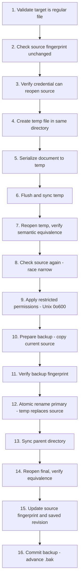

# Verified Persistence

`vault-session` owns filesystem paths and the multi-stage verified save protocol. It never exposes `keepass-rs` types and never retains the master password.

## VaultSession Lifecycle

<!-- openwiki: mermaid parse failed and this diagram was converted to a text fence so it does not break rendering. Fix the diagram source and restore the mermaid fence. Parser error: Parse error on line 2: ...Opened: VaultSession::open() Opened Expecting 'SPACE', 'NL', 'HIDE_EMPTY', 'scale', 'COMPOSIT_STATE', 'STRUCT_STOP', 'STATE_DESCR', 'ID', 'FORK', 'JOIN', 'CHOICE', 'CONCURRENT', 'note', 'acc_title', 'acc_descr', 'acc_descr_multiline_value', 'CLICK', 'classDef', 'style', 'class', 'direction_tb', 'direction_bt', 'direction_rl', 'direction_lr', 'EDGE_STATE', got 'DESCR' -->
```text
stateDiagram-v2
    [*] --> Opened: VaultSession::open()
    Opened --> Dirty: document mutation
    Dirty --> Saved: save() success
    Saved --> Dirty: document mutation
    Saved --> Clean: no changes
    Dirty --> Locked: lock()
    Saved --> Locked: lock()
    Clean --> Locked: lock()
    Locked --> [*]
```

## Key Types

| Type | Purpose |
|---|---|
| `VaultSession` | Holds canonical path, `KdbxDocument`, `FileFingerprint`, `saved_revision` |
| `FileFingerprint` | SHA-256 hash + byte size of complete encrypted file (no `Debug`) |
| `SaveOutcome` | `Unchanged` (no dirty mutations) or `Saved` (new generation written) |
| `SessionError` | Error type covering I/O, KDBX, and platform-specific failures |

## Public API

| Method | Purpose |
|---|---|
| `open(path, credential)` | Canonicalize path, reject symlinks/non-regular files, fingerprint before+after parse |
| `projection()` | Fresh `Vault` snapshot from current in-memory state |
| `is_dirty()` | Whether in-memory mutations exist since last save |
| `path()` | Canonical source path |
| `document()` / `document_mut()` | Borrow the opaque `KdbxDocument` |
| `save(credential)` | 16-step verified atomic persistence |
| `lock()` | Consume session, drop all decrypted state |

## Save Protocol (16 Steps)

The save protocol ensures that a failed write never corrupts the canonical file. Every filesystem boundary is verified.



**Key properties:**

- A failed pre-primary save does not advance the recovery generation
- A clean save (no dirty mutations) performs no filesystem I/O
- The backup is an exact copy of the previous ciphertext, not a re-serialization
- Permissions are restricted to owner-only on Unix (`0o600`)

## Fingerprint Verification

`FileFingerprint` is computed over the complete encrypted bytes (SHA-256 + file size). It is checked:

1. Before opening (detect mid-open tampering)
2. After parsing (verify no concurrent modification during parse)
3. Before save (verify source hasn't changed since session opened)
4. After backup copy (verify backup matches expected ciphertext)
5. After atomic rename (verify final target matches expected ciphertext)

## Platform Support

| Platform | Open/Read | Save |
|---|---|---|
| Linux | Supported | Supported |
| macOS | Supported | Supported (untested in CI) |
| Windows | Supported | **Disabled** — fails with `UnsupportedPersistencePlatform` |

### Windows Limitation

Windows save is disabled pending a safe-Rust, security-preserving replacement implementation. The current `keepass-rs` save path does not preserve NTFS DACLs (discretionary access control lists), and the failure states do not guarantee the canonical path remains present. See [write safety](/docs/write-safety.md) for the full analysis.

## Error Types

| Variant | Meaning |
|---|---|
| `SessionError::Io` | Filesystem operation failed |
| `SessionError::Kdbx` | KDBX adapter error (parse, conversion, verification) |
| `SessionError::UnsupportedPersistencePlatform` | Save not supported on this platform |
| `SessionError::TamperedSource` | Source file changed during open or save |
| `SessionError::CredentialMismatch` | Credential cannot reopen the current source |
| `SessionError::VerificationFailed` | Semantic equivalence check failed after write |
| `SessionError::BackupFailed` | Backup copy or verification failed |

## Design Decisions

- **No retained credentials**: The master password is supplied per-operation and never stored in the session.
- **No cooperative locking**: Persistence uses optimistic conflict detection, not distributed locking.
- **Backup before replace**: The previous ciphertext is always backed up before atomic rename.
- **Same-directory temp**: Temp files are created in the same directory as the target to ensure same-filesystem atomic rename.
- **Revision tracking**: `KdbxDocument` maintains a monotonic revision counter; `VaultSession` tracks `saved_revision` for dirty detection.
