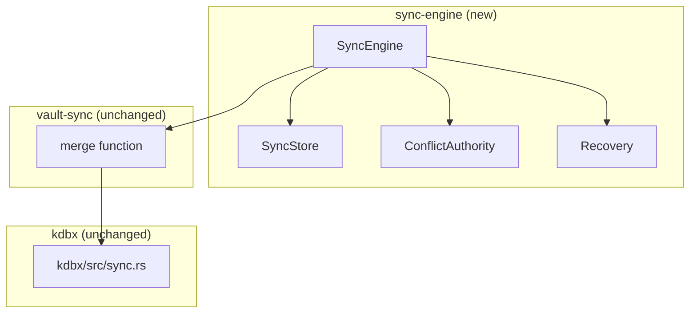
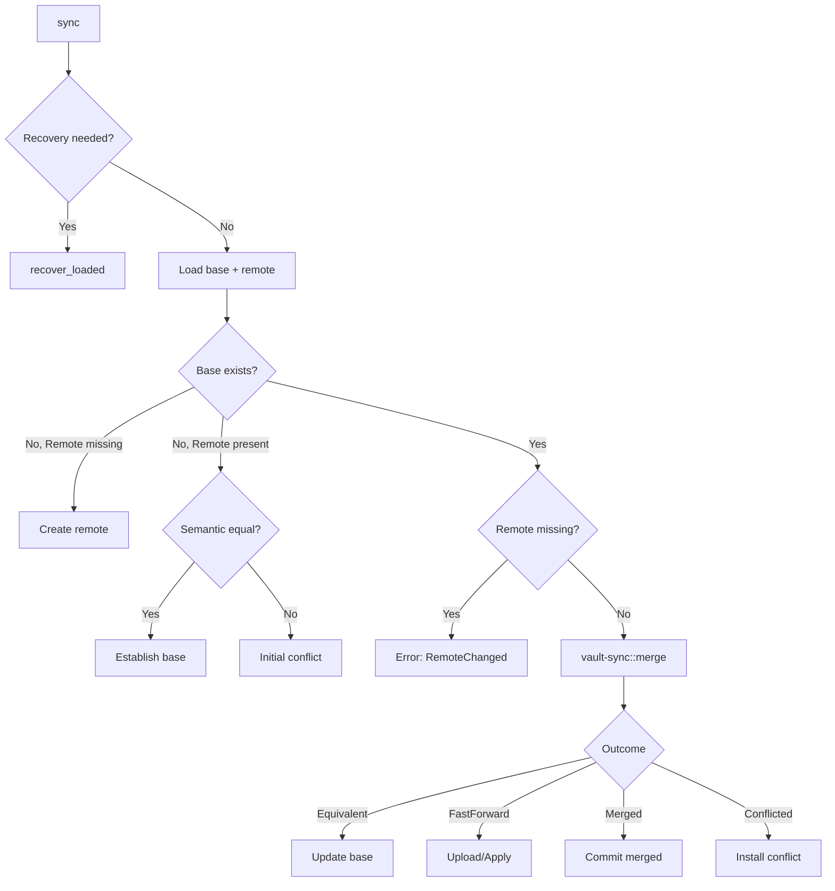

# Three-Way Sync Engine

The sync engine has been restructured from `kdbx/src/sync.rs` + `vault-sync` into a dedicated three-crate architecture.

## Crate Responsibilities



| Crate | Responsibility | I/O |
|---|---|---|
| `kdbx/src/sync.rs` | Pure semantic merge primitives | None |
| `vault-sync` | `merge(base, local, remote)` API | None |
| `sync-engine` | Orchestration, persistence, recovery | Filesystem, network |

## Public API Surface (`sync-engine/src/lib.rs`)

```rust
pub use conflict::{ConflictChoice, ConflictDescriptor, ConflictOperation};
pub use engine::{SyncCompletion, SyncEngine, SyncOutcome};
pub use error::SyncError;
pub use local::{LocalCommitError, LocalSnapshot, LocalVault};
pub use store::{ProfileId, RecoveryStatus, SourceBinding, StoreError, SyncStore, TargetBinding};
```

### Core Types

| Type | Purpose |
|---|---|
| `SyncEngine` | Profile-scoped sync orchestrator with one pending conflict max |
| `SyncStore` | Private profile-scoped BASE + journal persistence |
| `LocalSnapshot` | Clean local generation captured before network work |
| `LocalVault` trait | Desktop-local capture/replace boundary |
| `ConflictAuthority` | Process-local single-use conflict holder |
| `ConflictChoice` | `KeepLocal` or `KeepRemote` resolution |
| `SyncOutcome` | `Done(completion)` or `Conflict(operation)` |

## Conflict Authority (`conflict_authority.rs`)

**What is this?** A mutex-protected singleton holding at most one pending `PendingConflict`. It enables deferred user-mediated conflict resolution:

1. Engine installs conflict with local snapshot, remote bytes, and revision
2. Returns `ConflictOperation` with random UUID token
3. User calls `resolve(token, choice)` to apply decision
4. Engine revalidates all preconditions before committing

**Key invariants:**
- Single pending conflict per engine (process-local)
- Token required for resolution (stale protection)
- New sync attempts invalidate pending conflicts

## Store Layer (`store.rs` + `store/journal.rs` + `store/metadata.rs`)

**Profile-scoped persistence** with atomic writes and schema versioning:

| Component | Purpose |
|---|---|
| `SyncStore` | Opens profile directory under `~/.openwiki/sync/{profile_id}/` |
| `BaseState` | Encrypted BASE ciphertext with digest + remote revision |
| `JournalRecord` | Crash-recovery journal with phase tracking |
| `MetadataSchema` | Version validation (`SCHEMA_VERSION = 2`) |

**Journal phases:**
```
Prepared → RemoteCommitted → LocalCommitted → [cleanup]
```

**Recovery status:**
- `None` - no journal, clean state
- `Required` - journal exists, must recover before new sync
- `Unsupported` - future schema, requires reset

**Metadata files:**
- `base.json` - BASE ciphertext reference + identity bindings
- `journal.json` - Active sync operation state
- `base-{uuid}.kdbx` - BASE ciphertext blob
- `candidate-{uuid}.kdbx` - Merged candidate ciphertext

## Engine (`engine.rs`)

**Sync flow:**



**Key methods:**
- `sync()` - Full sync attempt with recovery check
- `resolve()` - Apply user conflict choice with revalidation
- `merge_existing()` - Three-way merge with BASE/LOCAL/REMOTE
- `commit_candidate()` - Atomic remote write + local replace + journal cleanup

## Store I/O (`store_io.rs`)

Low-level filesystem operations with security hardening:

| Property | Implementation |
|---|---|
| Atomic writes | `AtomicWriteFile` (no partial visibility) |
| Symlink rejection | All reads check `is_symlink()` |
| Permissions | 0o600 files, 0o700 directories |
| Size limits | Metadata capped at 64 KB |
| fsync | Directory sync on Unix |

## Error Types

**`SyncError`** (orchestration):
- `Provider`, `Store`, `Local`, `Merge` - wrapped source errors
- `RemoteChanged`, `LocalChanged` - concurrency conflicts
- `StaleConflict` - conflict token invalid/consumed
- `UncertainState` - crash recovery needed

**`StoreError`** (persistence):
- `CorruptBase`, `CorruptJournal` - integrity failures
- `WrongProfile`, `WrongSource`, `WrongTarget` - identity mismatches
- `ActiveJournal` - journal already exists
- `UnsupportedSchema` - future schema version

## Provider Abstraction (sync-provider-core)

The `RemoteObjectProvider` trait defines three CAS operations:

```rust
pub trait RemoteObjectProvider {
    async fn read(&self) -> Result<RemoteRead, ProviderError>;
    async fn create_if_absent(&self, data: &[u8]) -> Result<RemoteRevision, ProviderError>;
    async fn replace_if_revision(&self, data: &[u8], expected: &RemoteRevision) -> Result<RemoteRevision, ProviderError>;
}
```

| Method | HTTP Equivalent | Behavior |
|---|---|---|
| `read()` | `GET` | Returns encrypted bytes + opaque revision |
| `create_if_absent()` | `PUT If-None-Match: *` | Create only if remote is empty |
| `replace_if_revision()` | `PUT If-Match: <revision>` | Replace only if revision matches |

No unconditional write exists — all writes are compare-and-swap. A race becomes `remoteChanged`, never a blind overwrite.

### Provider Implementations

| Provider | Crate | Transport | Revision Format |
|---|---|---|---|
| WebDAV | `sync-provider-webdav` | HTTP/WebDAV with `reqwest` + `rustls` | Strong ETag |
| AWS S3 | `sync-provider-s3` | AWS SDK S3 | Object metadata |
| Sync Gateway | `sync-provider-gateway` | HTTP with `reqwest` + `rustls` | SHA-256 of ciphertext |

All providers enforce: production endpoints require HTTPS; plaintext HTTP accepted only on loopback for local tests.

## Sync Gateway

The sync gateway (`apps/sync-gateway`) is a standalone HTTP server for self-hosted zero-knowledge sync. See [self-hosting](/docs/self-hosting.md) for deployment.

- **Server:** Hyper-based HTTP/1.1, bearer token auth (SHA-256 digest, constant-time), filesystem backend with per-vault files and exclusive process lock
- **Client:** `sync-provider-gateway` implements `RemoteObjectProvider` over HTTP with post-write confirm
- **Wire format:** `sync-gateway-protocol` defines token bounds (32–512 visible ASCII chars) shared between server and client
- **CAS operations:** Conditional writes with `ETag`/`If-Match`, max 64 MiB per vault

## Integration with Desktop

Desktop triggers sync via the `sync_now` Tauri command:

1. Frontend calls `sync_now` with profile ID and freshly entered provider credentials
2. Rust backend loads the sync profile, creates provider instance
3. `SyncEngine::sync()` runs the full lifecycle
4. On conflict, the UI shows conflict resolution panel
5. User resolves, `SyncEngine::resolve()` completes the commit

Sync requires: clean saved vault, real master password, freshly entered provider credentials. No credential persistence, no background sync, no push notifications.

## Migration Summary

### Before
- `kdbx/src/sync.rs` (~2382 lines) - merge engine + conflict types
- `vault-sync` - thin wrapper around merge

### After
- `kdbx/src/sync.rs` - **unchanged** (pure merge primitives)
- `vault-sync` - **unchanged** (`merge()` API)
- `sync-engine` - **new** (orchestration, persistence, recovery)

### Benefits
1. **Separation of concerns**: Pure merge vs. orchestration vs. persistence
2. **Testability**: Each layer independently testable
3. **Reusability**: `sync-engine` can be used by different frontends
4. **Security**: Dedicated I/O layer with consistent hardening
5. **Recovery**: Explicit crash-recovery journal with schema versioning

## Test Coverage

Integration tests (`vault-sync/tests/merge.rs`) cover:
- Fast-forward both directions
- Independent field edits merging
- Delete-vs-modify conflicts
- Concurrent entry/group creation
- Move-vs-move conflicts
- Group hierarchy operations
- Reorder detection

All candidates round-tripped through serialize → reopen → `verify_semantic_equivalence`.