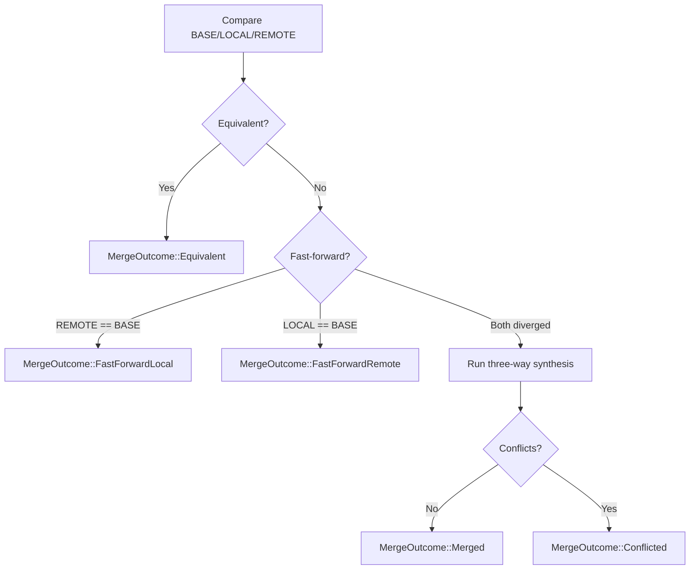

# Three-Way Sync Engine

The sync engine performs provider-independent, synchronous three-way semantic merge on already-opened `KdbxDocument` triples. It lives in `kdbx/src/sync.rs` (~1700 lines) and is orchestrated by the `vault-sync` crate.

## Merge Model

The caller supplies an explicit last common **BASE**, plus already-opened **LOCAL** and **REMOTE** `KdbxDocument` values. The engine does not open files, select generations, or perform any I/O.



**Three-way choice per element:** If LOCAL == BASE, take REMOTE. If REMOTE == BASE, keep LOCAL. If both changed, attempt synthesis or report conflict.

## Fast-Forward Shortcuts

Before running full synthesis, the engine checks three shortcuts:

1. **Equivalent**: `local.semantically_equals(remote)` — no merge needed
2. **FastForwardLocal**: `remote.semantically_equals(base)` — local is the safe successor
3. **FastForwardRemote**: `local.semantically_equals(base)` — remote is the safe successor

These comparisons use structural equality that ignores salts, IVs, and nonces — only parsed semantics matter.

## Conflict Types

The engine produces structured, value-free conflict descriptors. Conflicts identify an object and a field category but never carry competing plaintext.

### `SyncConflictKind` (11 variants)

| Kind | Meaning |
|---|---|
| `FieldEdit` | Both branches changed one field differently |
| `DeleteVsModify` | One branch deleted an object changed by the other |
| `MoveVsMove` | Both branches moved one object to different parents |
| `GroupDeleteVsDescendantChange` | A deleted group contains a changed or new descendant |
| `UuidCollision` | Both branches introduced different objects with the same UUID |
| `HierarchyCycle` | The proposed hierarchy would be cyclic or invalid |
| `Metadata` | Database-level or group-level metadata diverged ambiguously |
| `Binary` | Attachment state could not be combined without loss |
| `CustomIcon` | Custom-icon state could not be combined without loss |
| `History` | Entry history could not be combined without loss |
| `UnsupportedSemantic` | Parsed semantics cannot currently be synthesized safely |

### `SyncConflictObject`

| Variant | Meaning |
|---|---|
| `Entry(EntryId)` | A KDBX entry identified by stable UUID |
| `Group(GroupId)` | A KDBX group identified by stable UUID |
| `DatabaseMetadata` | Database-wide metadata |

### `SyncConflictFieldKind`

| Variant | Meaning |
|---|---|
| `Standard` | A standard KeePass entry field (Title, UserName, etc.) |
| `Custom` | A non-reserved custom entry field |
| `Reserved` | A reserved KeePass/KeePassXC field |
| `EntryMetadata` | Other entry metadata |
| `GroupMetadata` | Group metadata |
| `DatabaseMetadata` | Database metadata |

## What Participates in Merge

The engine operates on the complete parsed KDBX representation:

- **Entries**: field values, protection state, hierarchy location, UUID identity
- **Groups**: name, hierarchy location, child ordering, UUID identity
- **Custom icons**: icon ID mapping and referenced icon data
- **Metadata**: database-level and group-level metadata
- **Tombstones**: deleted-object records for sync-aware deletion tracking
- **History**: entry change history (attachment-free history can be unioned; attachment-bearing history that crosses database generations fails closed)
- **Child order**: surviving BASE-relative order is checked separately from membership

## Validation Invariants

Before returning a synthesized candidate, the engine validates:

1. **UUID uniqueness** across the merged tree
2. **Hierarchy acyclicity** — no cycles in the group tree
3. **Root identity** — root group UUID and location remain fixed
4. **Tombstone consistency** — deleted objects have valid tombstones
5. **Custom-icon referential integrity** — no orphaned icon references

A candidate that violates any invariant returns `KdbxError::SyncInvariant` rather than an incorrect merge.

## Integration with `vault-sync`

The `vault-sync` crate wraps the engine with version checking and input validation:

```rust
pub fn merge(base, local, remote) -> Result<MergeOutcome, MergeError>
```

**Preconditions checked:**

1. All three inputs use the same KDBX version
2. All three pass `validate_for_sync()` (UUID, tombstone, root, hierarchy invariants)
3. Only KDBX 4.1 proceeds to full synthesis (other versions return `MergeError::UnsupportedVersion`)

**Postcondition:** A synthesized `MergedDocument` must pass `verify_semantic_equivalence` round-trip before return.

## Error Types

| Type | Variants |
|---|---|
| `MergeError` | `VersionMismatch`, `InvalidInput`, `UnsupportedVersion`, `Kdbx(KdbxError)` |
| `KdbxError::SyncInvariant` | Synthesized candidate violated a required invariant |

## Test Coverage

The integration test suite (`vault-sync/tests/merge.rs`) covers:

- Fast-forward in both directions
- Version mismatch rejection
- Identical changes → equivalent
- Independent field edits merging
- Divergent password → conflict
- Delete-vs-modify
- Concurrent deletes
- Move + field merge
- Move-vs-move conflict
- Custom fields + protection conflicts
- Concurrent entry creation ordering
- Group rename + child edit
- Group move + rename
- Group delete vs descendant edit
- Group delete vs new descendant
- Concurrent group move cycles
- Reorder-detection tests

All merged candidates are round-tripped through serialize → reopen → `verify_semantic_equivalence`.
